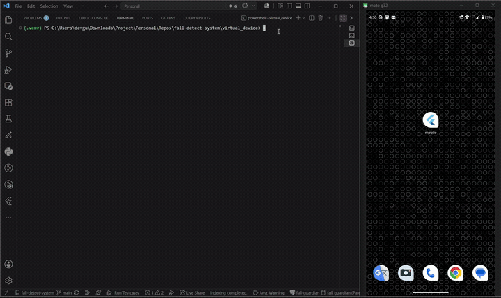
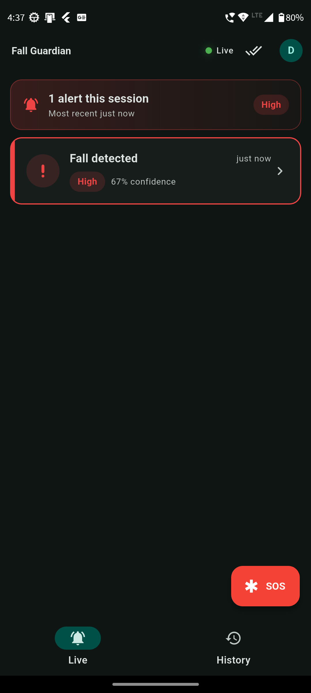
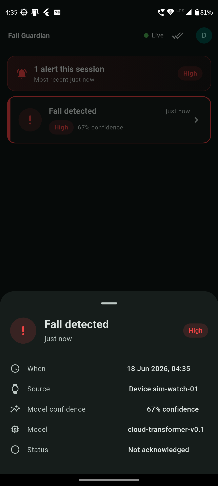
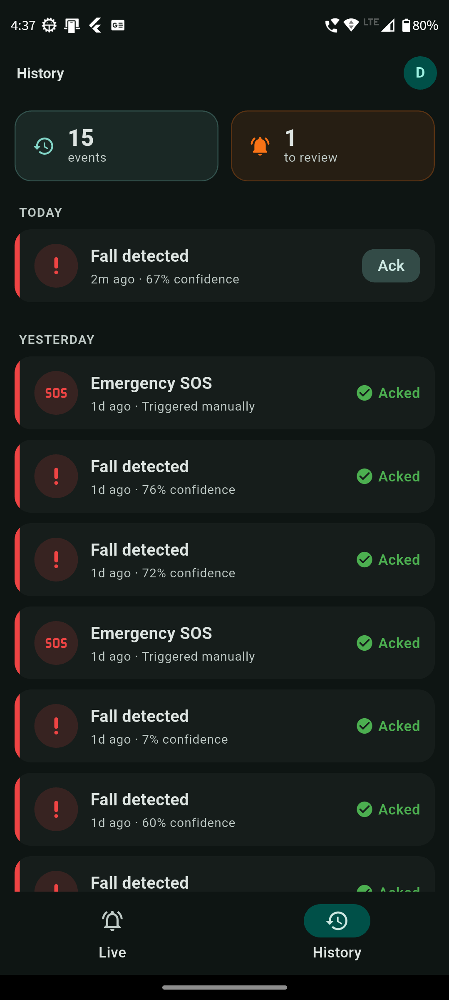

# Fall Guardian v3

Industry-grade wrist-worn fall prediction & detection system for elderly users (Indian context).

> ✅ **Status:** Feature-complete (Weeks A–F). Edge ConvLSTM-tiny shipped (96.5% recall, ~46 KB INT8); cloud Transformer detector trained with **5-fold cross-validation** and **served in-process via ONNX** (heuristic stub retired); edge→cloud cascade ADL false-positive rate **0.7%**. Full backend (auth, RLS, rate limiting, SSE), Flutter caregiver app (live alerts + **additive FCM** + emergency SOS), ESP32-S3 firmware, and CI all in place. **Runs locally** (Docker Compose + an ngrok tunnel) — no cloud bill. See [Build sequence](#build-sequence) below and the full runbook in [`docs/RUN.md`](docs/RUN.md).

## The system in one diagram

```text
   ESP32-S3 wrist wearable                FastAPI gateway (local :8000)
   (MPU6050 IMU @ 50 Hz)                  exposed via an ngrok HTTPS tunnel
   ┌──────────────────────┐               ┌──────────────────────┐
   │  Edge model          │               │  Cloud model         │
   │  ConvLSTM-tiny INT8  │ ─── alerts ─► │  Transformer (ONNX)  │
   │  ~46 KB · <80 ms     │               │  full sliding window │
   │  predicts PRE-impact │               │  confirms / cancels  │
   │  (~256 ms lead time) │               │  + assigns severity  │
   └──────────────────────┘               └──────────┬───────────┘
                                                     │
                                       SSE (foreground) + FCM (background/killed)
                                                     │
                                          ┌──────────▼───────────┐
                                          │  Flutter caregiver   │
                                          │  app — live alerts,  │
                                          │  timeline, SOS,      │
                                          │  pairing, calibration│
                                          └──────────────────────┘
```

**The headline:** the wearable can alert in the **~300 ms window between fall initiation and ground impact** — not just after the person hits the floor. The whole path runs on your laptop and can be driven end-to-end with **no hardware** via the [`virtual_device/`](virtual_device/) WEDA-FALL replay simulator.

## Demo

A fall fired from the [`virtual_device/`](virtual_device/) simulator → confirmed by
the cloud detector → alert on the caregiver's phone, running end-to-end on a laptop
with **no hardware**:

<p align="center">
  
</p>

▶ [Full-quality screen recording](docs/assets/fall-alert-demo.mp4)

### The caregiver app (Flutter)

<p align="center">
  
  &nbsp;&nbsp;
  
  &nbsp;&nbsp;
  
</p>

<p align="center"><em>Live alerts over SSE · per-event detail (severity, confidence, model, lead time) · history with acknowledge.</em></p>

## Personalization — the local grace period

A core product feature, not an afterthought: the system **learns each user's false alarms**. The edge model is recall-first and fires often by design, so when it triggers the watch first buzzes locally for a **~10 s grace period**. If the user presses **Cancel** (it wasn't a fall), no caregiver is alerted — instead the watch silently uploads that exact 2.5 s window to the cloud, where it is stored as labeled training data (`CANCELED_FALSE_ALARM`) for **per-user fine-tuning and threshold tuning**. The user is the ground truth for their own non-falls.

This splits ingestion into two paths that never cross: emergencies (`POST /v1/inference` → cloud detector → caregiver) and canceled false alarms (`POST /v1/retraining` → stored for MLOps, detector skipped). See [`docs/ARCHITECTURE.md`](docs/ARCHITECTURE.md) §3.2/§8 and [`docs/DECISIONS.md`](docs/DECISIONS.md) ADR-011.

## Why a rebuild

This project replaces two earlier prototypes (`fall-detect-system`, `fall-simulated`) — both functional proofs of concept, neither production-grade. A deep audit surfaced 20+ specific issues across ML (single-sample inference on synthetic data), security (no auth, world-writable Firestore rules), and UX (an "emergency button" claimed in README but missing from code). The full audit lives in [`docs/AUDIT_v1_v2.md`](docs/AUDIT_v1_v2.md). v3 is the ground-up rebuild that fixes them.

## Monorepo layout

| Folder | What it is |
|---|---|
| [`ml/`](ml/) | PyTorch training, MLflow experiment tracking, datasets, feature engineering, ONNX/TFLite export, 5-fold cross-validation |
| [`backend/`](backend/) | FastAPI gateway — in-process ONNX detector + Postgres (RLS) + JWT auth + Redis rate limiting + SSE + additive FCM |
| [`mobile/`](mobile/) | Flutter caregiver app — Riverpod 3, live SSE alerts, timeline + acknowledge, emergency SOS, pairing + calibration, FCM |
| [`edge/`](edge/) | ESP32-S3 firmware — PlatformIO + TFLite Micro (sensing, inference, grace period, BLE pairing, HTTPS uplink) |
| [`virtual_device/`](virtual_device/) | WEDA-FALL replay simulator — drives the whole gateway path without real hardware |
| [`docs/`](docs/) | Architecture, runbook, audit of v1/v2, decisions (ADRs), validation methodology, model card, build log |

> The locked design also called for a Next.js web dashboard; it was dropped in
> favor of the Flutter app as the caregiver client (see [`docs/ARCHITECTURE.md`](docs/ARCHITECTURE.md) §2.5).

## Datasets — wrist-worn only

We deliberately use only **wrist-worn** training data — domain adaptation from waist or chest data is not a credible production approach.

- **[WEDA-FALL](https://github.com/joaojtmarques/WEDA-FALL)** — primary training set. Wrist-worn Fitbit Sense; 25 subjects (14 young + 11 elderly aged 77–95); 11 ADL × 8 fall types; 50 Hz; accel + gyro + orientation; manually-labeled fall windows. We **re-derive pre-impact labels** programmatically from the fall windows and validate against the dataset's ground-truth labels — methodology documented in [`ml/DATA.md`](ml/DATA.md).
- **[SmartFall](https://www.mdpi.com/1424-8220/18/10/3363)** (Texas State) — secondary. 9 elderly subjects wearing a smartwatch 3 hrs/day × 7 days each. Real-world wear pattern; great ADL diversity. Accel-only (limitation).
- **[UP-Fall](https://pmc.ncbi.nlm.nih.gov/articles/PMC6539235/)** wrist channel — cross-dataset generalization testing only (different device, 18 Hz — proves the model isn't overfit to Fitbit-specific signal).
- **Indian-ADL supplement** — our own collection (Week E): sukhasana (cross-legged sit), namaste, getting up from floor, squat toilet, intentional wrist motions (eating, waving, brushing, doors). Public datasets miss these.

## Honest validation methodology

The defining feature of v3 vs v1/v2 is that the metrics are *trustworthy*:

- **Subject-stratified k-fold cross-validation** — never train and test on the same subject
- **Held-out test subjects** — 20% of subjects entirely out of training/validation
- Real-world ADL augmentation from the Indian-ADL set
- Honest metrics: precision, recall, F1, **FPR on ADL** (the metric that matters), **lead-time histogram** for the prediction model, ROC + AUC
- Platt-scaling / isotonic calibration so probability outputs are trustworthy
- Every experiment MLflow-tracked + reproducible

## Targets

| Component | Target |
|---|---|
| Edge model (prediction) | recall ≥ 95% on WEDA-FALL held-out subjects, FPR ≤ 5% on ADL, mean lead time ≥ 300 ms |
| Cloud model (detection) | recall ≥ 97% on WEDA-FALL held-out subjects, FPR ≤ 2% on ADL |
| End-to-end pipeline | false-positive rate ≤ 0.5 per day in continuous-wear simulation |
| Edge model size | ≤ 100 KB INT8 |
| Edge inference latency | < 80 ms on ESP32-S3 |
| Wearable battery | ≥ 24 h continuous wear |

## Build sequence

| Week | Focus | Deliverables | Status |
|---|---|---|---|
| **A** | Data foundation | WEDA-FALL download · loaders · sliding-window + feature extraction · EDA · MLflow setup | ✅ |
| **B** | Edge model | Train ConvLSTM-tiny on WEDA-FALL · INT8 quantize · size + simulated latency report | ✅ |
| **C** | Cloud model + backend skeleton | Transformer detector (served **in-process as ONNX**) · FastAPI + Postgres + JWT · `/v1/inference` (emergency) **+ `/v1/retraining` (canceled-false-alarm capture)** | ✅ |
| **D** | Backend infrastructure | Async SQLAlchemy + Alembic (8 tables) · per-user/per-device JWT + 8-char pairing · Postgres RLS (`fall_app`) · Redis rate limiting · **SSE caregiver feed** | ✅ |
| **E** | Mobile rebuild | Flutter (Riverpod 3) — auth + pairing + live SSE alerts + timeline/acknowledge + **emergency SOS** + calibration onboarding + **additive FCM** (background/killed) | ✅ |
| **F** | ML hardening + edge firmware + production | **5-fold cross-validated** cloud re-export (baseline kept in `model_old/`) · **ESP32-S3 firmware** (TFLite Micro + grace period + BLE pairing) · Docker + GitHub Actions CI + structured logging | ✅ |
| **Deploy** | Local-first | **Docker Compose (Postgres + Redis) + ngrok tunnel** to a physical phone — zero-cost, zero-latency (replaced the managed-cloud plan) | ✅ |

## License

MIT — see [LICENSE](LICENSE).
